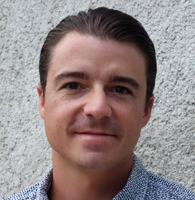

{: width="200px" .center-image}

Depuis Janvier 2019, je suis l'heureux fondateur de la société _TrueLines_ et propose mes services de développeur Go (Golang), Java, Spring et Eclipse RCP et de formateur Git.

Diplômé de l'ENSIMAG et de l'Imperial College London et justifiant de plus de 10 ans d'expérience dans le développement Java, Spring et Eclipse RCP notamment pour des grands groupes tels que Thales, Airbus ou encore DCNS et dans le domaine spatial, militaire ou traitement d'images, je vous invite à consulter mon profil <a href="http://www.linkedin.com/in/FabriceFontenoy" target="_blank">LinkedIn</a> pour plus d'information me concernant.

Si vous êtes intéressé par mon profile, n'hésitez pas à me contacter en m'envoyant un message depuis la page de <a href="contact.html" target="_blank">Contact</a> ou via mon profil <a href="http://www.linkedin.com/in/FabriceFontenoy" target="_blank">LinkedIn</a>.

